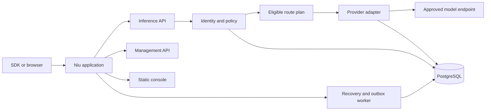

# Niu architecture

Status: implementation has started with one selectively reused pricing module. All service and deployment behavior below remains proposed until implemented and verified.

## Product goals

Niu focuses on performance and cost, with security as its foundation. Performance covers the full path, including authorization, routing, accounting, content policy when enabled, and response delivery. Cost covers provider spend, retries, deployment resources, and the work required to operate and reconcile the system. Compare configurations under equivalent task, protocol, and safety requirements.

Security constraints are not optimization scores. A candidate that violates tenant permissions, credential ownership, required content policy, or data-region rules is ineligible even when it appears faster or cheaper.

## Runtime shape

The deployment target is one Niu application container and one public port, serving inference APIs, management APIs, the console, authentication, and background work. PostgreSQL is the persistent external dependency. A small Compose profile may run Niu alongside PostgreSQL for first-time installations.

The application will begin as a modular service. Module boundaries describe code ownership and do not require separate containers. Additional services or runtime dependencies require evidence that they improve performance, safety, or operating cost.

## Request lifecycle

One coordinator owns each request and all of its attempts. It authenticates a trusted tenant identity, checks protocol support and model permissions, builds an eligible provider set, applies required safety policies, reserves applicable budgets, persists the attempt intent, and invokes the provider adapter.

A retry must recheck permissions and eligibility, stay within the shared deadline and retry limit, and reserve any new cost exposure before another attempt. An adapter or SDK must not silently perform additional retries. Once a successful response has been committed to the client, the first release will not switch providers.

Execution, delivery, and financial settlement are separate state axes. An EOF does not by itself prove protocol completion or zero cost. If execution may have reached a provider but usage is unknown, preserve the reservation for reconciliation rather than guessing that the request did not run.

## Cost path

The selected `niu-cost` module calculates provider cost from normalized usage and an immutable provider price revision. Customer charges, provider liabilities, and any cost absorbed by Niu are accounted for separately. Every retry retains its own provider attempt record, including when the customer is not charged for it.

The initial pricing engine uses floating-point rates for calculations. It is not itself a ledger or a proof of a strict budget ceiling. Before production charging, the gateway must convert and round calculated amounts into explicit currency units, validate rate and usage bounds, and persist reservations and ledger entries transactionally.

## Security and configuration

API keys identify a tenant and scope. Organization, project, key, and request permissions narrow the eligible set at each level. Required policy failures block dispatch. Provider secrets never appear in browser code, logs, or public configuration responses.

Configuration changes are validated as a complete candidate before publication. Each request pins one configuration revision; admission also checks live key and provider revocation state. A revoked credential prevents new attempts after the revocation transaction commits. Work already admitted may still be in flight.

## Code ownership

`niu-io/niu` contains the independent community implementation, public UI, contracts, tests, documentation, and community image. `niu-io/enterprise` owns enterprise services, enterprise releases, and hosted application code. `niu-io/website` owns the public marketing site. `niu-io/.github` presents the open source organization.

Enterprise features extend a pinned public Niu release through public versioned contracts. The public project does not depend on private packages or services.
