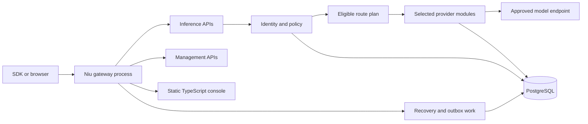

# Niu architecture

Status: mixed-language monorepo and first gateway runtime slice are under active implementation. Niu targets an open-source Agent Observability and Benchmark product with a complete integrated AI gateway and management runtime. Current behavior is described in the implemented API contract; remaining design goals are not shipped guarantees.

## Product goals

Niu focuses on performance and cost, with security as its foundation. Performance covers the complete path, including authorization, routing, accounting, required policy, and response delivery. Cost covers provider spend, retry exposure, deployment resources, and the work required to operate and reconcile the system. Compare equivalent tasks, protocol capabilities, and safety requirements.

Security constraints are not optimization scores. A candidate that violates tenant permissions, credential ownership, required policy, or data-region rules is ineligible even when it appears faster or cheaper.

## Monorepo shape

```text
apps/
  gateway/       Rust API process, inference, control endpoints, workers
  console/       TypeScript management console, built to static files
  docs/          Astro Starlight documentation site
contracts/       OpenAPI and versioned wire contracts
crates/          Niu-owned execution contracts and cost components
Dockerfile       single-image container build
compose.yaml     one-container evaluation deployment
sdks/            supported client SDKs
vendor/
  litellm-rust/  selected native provider and protocol modules
branding/        approved visual system and provenance
```

The four-repository ownership boundary remains: `niu` owns the public product, `enterprise` owns private and hosted features, `website` owns the marketing site, and `.github` owns organization presentation. The monorepo boundary does not create a multi-service deployment requirement.

## Runtime shape

The deployment target is one Niu application container and one public port. The Rust process serves inference APIs, management APIs, authentication, health and metrics, background recovery, and the static TypeScript console. The docs site is built and deployed as static documentation outside the inference runtime. PostgreSQL stores tenant identity, scoped keys, operations and attempt evidence; durable financial accounting remains in progress.



The gateway uses a read-only TOML model catalog, PostgreSQL identity and attempt storage, and process-local metric counters. Atomic budget reservations, dynamic configuration publishing, financial settlement and crash reconciliation remain required product work.

## Task evidence and standalone observation

The primary product unit is an accepted task outcome. Imported telemetry and native execution must share task, agent/subagent, step, invocation, attempt and validation identities. Parentage describes containment; typed causal links describe delegation, retries, parallel dependencies and resumed work. A simple request tree cannot represent shared work accurately.

Read-only collection and investigation must function without inference forwarding or pooling. Collectors default to metadata, declare coverage and provenance, and never trigger model calls or allowance changes. Subscription observations preserve shared windows and unattributed depletion. Actual model identity requires provider evidence, separate from the requested model.

Costs attach once to canonical execution/charge identities; task membership is an attribution relationship rather than another charge. Outcome records distinguish agent assertions, validators and human acceptance. Wall-clock latency uses observed interval bounds rather than summing parallel durations. Missing events, tool costs and intervals remain explicit gaps.

Benchmarks use the same evidence schema, frozen task setup and acceptance contracts. Diagnostics are labeled hypotheses unless backed by a paired experiment. Private optimizers consume these public contracts and remain subject to core authorization, budgets and side-effect boundaries.

This task-level layer is planned; existing request/attempt storage and the integer ledger are reusable foundations, not proof that task observability is complete.

## Request lifecycle

One Niu coordinator owns each request and its attempts. Model API calls and longer-running tool or agent tasks have distinct capability contracts, but share identity, policy, deadlines, attempt accounting, and outcome reporting. Agent tasks also need explicit workspace isolation and side-effect-aware recovery.

The coordinator authenticates a trusted tenant identity, checks protocol support and permissions, builds the eligible resource set, applies required policy, reserves budgets, persists attempt intent, and invokes one adapter. Retries recheck permissions and eligibility, share the request deadline, obey an explicit attempt limit, and reserve additional cost exposure before dispatch. An explicitly requested model is never silently replaced; automatic selection is opt-in. Unsupported capabilities fail clearly.

Provider adapters translate protocol semantics and perform one attempt. They cannot silently retry. Once successful response headers are committed to the client, the initial product policy does not switch providers. Execution, delivery, and financial settlement are separate states; uncertain usage remains pending reconciliation.

The initial shared types live in [`niu-execution`](crates/execution/README.md). They distinguish model-provider resources from agent runtimes, describe capability support as native, translated, limited, or unsupported, and keep execution certainty, response progress, usage confidence, and settlement state independent. The gateway has not yet wired this record into durable storage or every adapter.

## Implementation order

The public product should first make model and task capabilities explicit and give all work one attempt coordinator. Next it should attribute usage, estimates, missing usage, provider cost, customer charge, and platform exposure to individual attempts. A reproducible evaluator then measures cost at a required quality level and quality at a fixed budget, alongside latency and resource use. Durable budget reservations and settlement recovery must be in place before strict spending guarantees. Reference selection, health, quota-aware admission, affinity, and bounded queueing follow on these contracts. Automatic task classification and escalation depend on benchmark evidence and remain opt-in.

The single-container deployment is the delivery shape for this workflow, not a substitute for it. Console work should enable configuration, execution, and evidence review before expanding into presentation features.

## Cost path

The selected `niu-cost` module calculates provider cost from normalized usage and a price revision. Customer charges, provider liabilities, and cost absorbed by Niu are separate dimensions. Every retry retains an attempt record even when the customer is not charged for it.

The imported pricing engine uses floating-point calculations. It is not a ledger or proof of a strict budget ceiling. Production charging requires validated prices, integer currency units with explicit rounding, durable reservations, transactional ledger entries, and recovery tests.

## Security and configuration

Provider credentials stay server-side and are read from runtime secrets. Public model aliases map to trusted provider routes; callers cannot override credentials or endpoints. The process accepts an installation-wide bootstrap administrator token. Management endpoints create organizations, projects and persistent scoped keys. Client authentication uses hashed database keys with model grants and expiry; dispatch rechecks revocation under a transaction lock. Operator sessions, tenant roles and key rotation are still pending.

The target policy narrows permissions from organization to project, key, and request. Configuration changes are validated as a complete revision before publication. Each request pins one revision and checks live identity and provider revocation before a new attempt.

## Code ownership

`niu-io/niu` contains the independent community implementation, public UI, contracts, tests, documentation, and community image. `niu-io/enterprise` owns enterprise services, enterprise releases, and hosted application code. `niu-io/website` owns the public marketing site. `niu-io/.github` presents the open source organization.

Enterprise features extend a pinned public Niu release through public versioned contracts. The public project does not depend on private packages or services.

## Selective source reuse

Niu imports selected Rust packages from LiteLLM's native runtime rather than its full repository. Current imports cover provider operations and protocol transformations, shared types, authentication helpers, secret sources, HTTP transport, and tracing. Exact upstream commit, package paths, per-package hashes, and licenses are recorded in `vendor/litellm-rust/SOURCE-MANIFEST.json` and `THIRD-PARTY-NOTICES.md`.

The public project owns the application, route coordinator, management surface, console, contracts, persistence, and releases. Upstream imports do not imply feature parity; Niu's contracts and release tests determine supported behavior.
