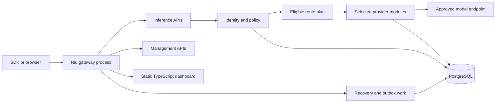

# Niu architecture

Status: mixed-language monorepo and first gateway runtime slice are under active implementation. Niu targets lower-cost model API access and transparent consumption, with independently usable gateway and management interfaces. The agreed scope is defined in [product focus](docs/product/product-focus.md). Current behavior is described in the implemented API contract; remaining design goals are not shipped guarantees.

## Product goals

Niu focuses on performance and cost, with security as its foundation. Performance covers the complete path, including authorization, routing, accounting, required policy, and response delivery. Cost covers provider spend, retry exposure, deployment resources, and the work required to operate and reconcile the system. Compare customer prices for explicit model usage and protocol capabilities. Customer charges, Supplier liabilities and platform margins remain separate; procurement costs are never exposed as customer charges.

Security constraints are not optimization scores. A candidate that violates tenant permissions, credential ownership, required policy, or data-region rules is ineligible even when it appears faster or cheaper.

## Monorepo shape

```text
apps/
  gateway/       Rust API process, inference, control endpoints, workers
  dashboard/       TypeScript management dashboard, built to static files
  docs/          Astro Starlight documentation site
contracts/       OpenAPI and versioned wire contracts
crates/          Niu-owned execution contracts and cost components
Dockerfile       single-image container build
compose.yaml     one-container evaluation deployment
sdks/            supported client SDKs
vendor/
  litellm-rust/  selected native provider and protocol modules
branding/        approved visual system and provenance
```

The four-repository ownership boundary remains: `niu` owns the public product, `enterprise` owns private and hosted features, `website` owns the marketing site, and `.github` owns organization presentation. The monorepo boundary does not create a multi-service deployment requirement.

## Runtime shape

The deployment target is one Niu application container and one public port. The Rust process serves inference APIs, management APIs, authentication, health and metrics, background recovery, and the static TypeScript dashboard. The docs site is built and deployed as static documentation outside the inference runtime. PostgreSQL stores tenant identity, scoped keys, operations and attempt evidence; durable financial accounting remains in progress.


```mermaid
flowchart LR
    Client[SDK or browser] --> App[Niu gateway process]
    App --> Inference[Inference APIs]
    App --> Management[Management APIs]
    App --> Dashboard[Static TypeScript dashboard]
    App --> Worker[Recovery and outbox work]
    Inference --> Auth[Identity and policy]
    Auth --> Plan[Eligible route plan]
    Plan --> Provider[Selected provider modules]
    Provider --> Model[Approved model endpoint]
    Auth --> DB[(PostgreSQL)]
    Provider --> DB
    Worker --> DB
```

The gateway uses a read-only TOML model catalog, PostgreSQL identity and attempt storage, and process-local metric counters. Atomic budget reservations, dynamic configuration publishing, financial settlement and crash reconciliation remain required product work.

## Gateway consumption evidence

The product unit is a model request and its attributable attempts, usage and customer charges. External orchestration clients own tasks, subagents, tools, scheduling, acceptance and productivity evaluation. Optional opaque correlation references allow clients to join their own records without moving task ownership into Niu.

Activity and Logs collect only requests handled by Niu. Niu does not accept external LLM-call logs, agent tool traces, or personal subscription usage imports. Supen owns complete agent execution observability; optional correlation references connect its task context to Niu gateway requests.

Existing task schemas and benchmark code are compatibility artifacts. They do not require a task runner, sandbox, acceptance evaluator or benchmark product in the current scope.

## Request lifecycle

One Niu coordinator owns each model request and its attempts. Agent orchestration clients independently own task retries, side effects and workspace isolation. A gateway retry is not evidence of a task retry or task completion.

The coordinator authenticates a trusted tenant identity, checks protocol support and permissions, builds the eligible resource set, applies required policy, reserves budgets, persists attempt intent, and invokes one adapter. Retries recheck permissions and eligibility, share the request deadline, obey an explicit attempt limit, and reserve additional cost exposure before dispatch. An explicitly requested model is never silently replaced; automatic selection is opt-in. Unsupported capabilities fail clearly.

Provider adapters translate protocol semantics and perform one attempt. They cannot silently retry. Once successful response headers are committed to the client, the initial product policy does not switch providers. Execution, delivery, and financial settlement are separate states; uncertain usage remains pending reconciliation.

The initial shared types live in [`niu-execution`](crates/execution/README.md). They distinguish model-provider resources from agent runtimes, describe capability support as native, translated, limited, or unsupported, and keep execution certainty, response progress, usage confidence, and settlement state independent. The gateway has not yet wired this record into durable storage or every adapter.

## Implementation order

The [current release matrix](docs/releases/first-release.md) governs sequencing: first qualify independent API access and durable consumption investigation; then qualify discounted supply and its customer billing/settlement. Multiple Suppliers for each model, agent routing and task benchmarks are not prerequisites.

Each advertised offer needs evidence of the Supplier's right and ability to supply, model identity, protocol behavior, data handling, availability and rates. Comparisons use current model-specific customer prices. Supplier procurement details and platform margins remain confidential.

## Cost path

The selected `niu-cost` module calculates provider cost from normalized usage and a price revision. Customer charges, provider liabilities, and cost absorbed by Niu are separate dimensions. Every retry retains an attempt record even when the customer is not charged for it.

The imported pricing engine uses floating-point calculations. It is not a ledger or proof of a strict budget ceiling. Production charging requires validated prices, integer currency units with explicit rounding, durable reservations, transactional ledger entries, and recovery tests.

## Security and configuration

Provider credentials stay server-side and are read from runtime secrets. Public model aliases map to trusted provider routes; callers cannot override credentials or endpoints. The process accepts an installation-wide bootstrap administrator token. Management endpoints create organizations, projects and persistent scoped keys. Client authentication uses hashed database keys with model grants and expiry; dispatch rechecks revocation under a transaction lock. Operator sessions, tenant roles and key rotation are still pending.

The target policy narrows permissions from organization to project, key, and request. Configuration changes are validated as a complete revision before publication. Each request pins one revision and checks live identity and provider revocation before a new attempt.

## Code ownership

`niu-io/niu` contains the independent community implementation, public UI, contracts, tests, documentation, and community image. `niu-io/enterprise` owns enterprise services, enterprise releases, and hosted application code. `niu-io/website` owns the public marketing site. `niu-io/.github` presents the open source organization.

Enterprise features extend a pinned public Niu release through public versioned contracts. The public project does not depend on private packages or services.

## Selective source reuse

Niu imports selected Rust packages from LiteLLM's native runtime rather than its full repository. Current imports cover provider operations and protocol transformations, shared types, authentication helpers, secret sources, HTTP transport, and tracing. Exact upstream commit, package paths, per-package hashes, and licenses are recorded in `vendor/litellm-rust/SOURCE-MANIFEST.json` and `THIRD-PARTY-NOTICES.md`.

The public project owns the application, route coordinator, management surface, dashboard, contracts, persistence, and releases. Upstream imports do not imply feature parity; Niu's contracts and release tests determine supported behavior.
