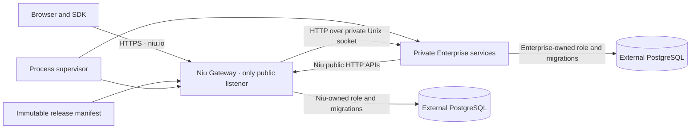

# Enterprise composition and service boundaries

Status: target architecture. This document is the public contract for the Enterprise distribution. It distinguishes planned behavior from behavior shipped by the community runtime.

## Decision

Compose Enterprise as a fixed release of independently built services behind the Niu Gateway. Keep one public HTTP listener and one product domain, `niu.io`; run private feature services as supervised processes behind private Unix sockets. The Gateway owns authentication, the public route table, and the only public bind address. Modules use versioned HTTP APIs and their own PostgreSQL role/schema.

Register modules at build time in one immutable Enterprise release manifest. At startup, the Gateway validates that manifest and checks the declared services' health. It does not discover arbitrary files, accept service self-registration, download modules, or hot-load code. This keeps the process boundary while avoiding a control plane that the fixed single-image deployment does not need.

This is a deliberate middle ground: more isolation than importing private Enterprise crates into the public Rust process, and less operational machinery than a dynamic plugin marketplace or a cluster service-discovery system.

## Product and repository ownership

The public Niu repository owns the independently buildable open-source platform: Gateway, core data plane, public control APIs, console shell, documentation, public contracts, and community image. It starts and remains useful without private modules.

The Enterprise repository owns private feature implementations and the Enterprise release composition. Each release pins one immutable public Niu commit and adds independently versioned private services. Enterprise does not keep a long-lived copy of the Niu core, import its private Rust internals, or read its database tables.

The separate `niu-io/website` repository owns the marketing homepage and marketing assets. Enterprise release composition pins an immutable website commit alongside the public Niu commit and installs their independently built artifacts into separate directories. Marketing source is not copied into the public platform or private module source.

The public Niu repository owns the stable integration contracts. Enterprise implements them and may use clients generated from them. Public code does not depend on an Enterprise package, source checkout, license service, or private build artifact.

## One product domain and runtime shape

All browser, API, and inference traffic uses `niu.io`. The homepage is at `/`, documentation at `/docs/`, model catalog at `/models/`, the console at `/workspaces/{workspace}/…`, public APIs at `/v1/` and `/admin/v1/`, and Enterprise APIs under `/enterprise/api/v1/{module_id}/…`. Enterprise pages live under `/enterprise/` in the same site and console shell; there is no separate application subdomain.

Repository boundaries do not create separate domains. The Gateway serves a separately built website artifact through `NIU_SITE_DIR` at `/`, `/site-assets/`, and `/_astro/`, plus `favicon.ico`, `robots.txt`, and `sitemap.xml`. Niu owns `/models/`, `/catalog-assets/`, and `/_catalog/` through `NIU_CATALOG_DIR`; documentation and console artifacts keep their own directories. The website artifact cannot override these product routes or API namespaces. Without `NIU_SITE_DIR`, the community root redirects to `/workspaces/default/` and builds without a website checkout. See [repository ownership](repository-ownership.md).

The Enterprise image contains one pinned Niu Gateway, a supervisor, and the private services selected for that release. Only the Gateway binds the public listener. The supervisor starts each declared service with a private Unix socket. PostgreSQL is an external persistent data service; no database process or data directory belongs in the application image.

The two database labels may be separate databases or separately permissioned schemas on one managed PostgreSQL service. Each product owns its migrations and database role. Enterprise services do not query or mutate Niu core tables. Replacing the application image does not erase either database.

## Registration, discovery, and loading

Enterprise modules are trusted release components, not user-uploaded plugins. The Enterprise build contains one immutable release manifest conforming to [`release-manifest.v1.schema.json`](../../contracts/enterprise/release-manifest.v1.schema.json). The manifest pins the exact Niu commit and lists each service's ID, version, supported contract range, required/optional status, private socket, HTTP route prefix, allowed methods, permission, request/response size limits, and deadline. It cannot choose an executable, public bind address, or arbitrary file to load.

The runtime uses static composition:

1. The Enterprise build pins a full Niu commit, installs the release manifest, and configures the supervisor with the matching service binaries. The supervisor configuration maps each manifest service ID to a fixed executable and private socket. CI rejects any mismatch between those release artifacts.
2. The supervisor starts only those configured processes. The Gateway reads and validates the manifest at startup: contract version, core compatibility, unique service IDs, route ownership, route namespace, limits, and socket paths.
3. The Gateway checks liveness and readiness through each declared private socket. It builds its static route table from the validated manifest. A request to an unhealthy service receives 503; readiness reflects current health, so recovered services can serve requests again. `/enterprise/readyz` reports combined distribution readiness (503 if the core database or a required service is unavailable; the check has a three-second deadline); the core `/readyz` remains based on Niu-owned requirements so a private module failure does not remove healthy core routes from service.
4. Route changes and service upgrades require a new immutable Enterprise image and process restart. There is no service self-registration, runtime code download, directory scan, dynamic Rust library loading, or hot reload.

The HTTP health protocol is described in [`module-service.v1.openapi.yaml`](../../contracts/enterprise/module-service.v1.openapi.yaml). Unix socket ownership and filesystem permissions restrict which processes can connect; no public control credential or separate control API is needed. V1 modules expose operator-authenticated HTTP APIs beneath their manifest-declared prefix. Public callbacks and other authentication modes need their own explicit versioned contract before they are added.

The Gateway authenticates the caller, authorizes the declared coarse permission and tenant scope, removes all client-supplied `X-Niu-*` and `X-Forwarded-*` headers, then replaces `Authorization` with a short-lived Gateway-signed compact JWS bearer token. It forwards only the documented content-negotiation and idempotency headers; modules use signed claims exclusively for actor, permission, and tenant scope. It applies Niu's operator-role matrix: `read` is available to owner/admin/viewer, `write` to owner/admin, and `manage_operators` to owner only. The JWS payload follows [`module-request-context.v1.schema.json`](../../contracts/enterprise/module-request-context.v1.schema.json), uses EdDSA, sets `aud` to exactly the target module ID, and binds the actor, effective organization/project scope, permission, method, full request target (path and query), request ID, body digest, and expiry (at most 60 seconds). Its protected header contains a `kid`. The Enterprise release supplies the Gateway's base64url Ed25519 seed and key ID as runtime secrets; modules receive only a JSON JWK set containing verification keys, which allows overlapping key rotation. The module validates the signature and still enforces resource ownership in its own database. Installation-wide bootstrap credentials and the user's raw bearer token are never forwarded.

The Gateway's route matcher requires a path-segment boundary and checks the HTTP method. A registered `/enterprise/api/v1/experiments` route cannot capture `/enterprise/api/v1/experiments-extra`. Manifest validation rejects overlapping prefixes and collisions with Niu-owned routes.

## Platform-to-Enterprise calls

The Gateway is the only public ingress. It proxies a request only to the service whose manifest entry owns the route. It has already authenticated the caller and checks the module's declared coarse permission before forwarding the signed actor context. Each route has fixed maximum request and response sizes and a deadline; cancellation and timeout are propagated to the service. Authenticated module responses use `Cache-Control: no-store`. The Gateway does not retry Enterprise requests; modules implement idempotency for mutations that clients may safely retry. An unmatched path returns 404, a disallowed method returns 405, and an unavailable service returns 503 without falling through to another module or a core handler.

The context is evidence of the caller and effective tenant scope, not an authorization bypass. A module cannot expand its own permissions, tenant scope, model grants, budget, credential access, attempt state, or revocation decisions. Niu remains authoritative for platform-owned policy and accounting. Optional feature data and decisions remain owned by the Enterprise service.

The public Rust capability traits do not automatically become remote plugin hooks. If a concrete Enterprise feature needs a synchronous hook, webhook, or durable event, define and version that interaction separately with its request/response or event schema, authorization, timeout, cancellation, retry, and failure behavior. Add a transactional outbox only for a concrete event delivery requirement; route registration alone grants no hook or event capability.

## Enterprise-to-platform calls

Enterprise services access platform features through the exact public HTTP/OpenAPI contracts shipped with their pinned Niu commit. They do not import Niu's private Rust crates or access Niu database tables.

- Model operations use a project-scoped Niu API credential. The core applies that project's grants, admission controls, provider routing, attempt recording, and canonical usage/cost accounting.
- Tenant administration uses Niu's scoped operator API. A module uses its own least-privilege operator credential scoped to the organization/project it serves; the human actor remains in the signed context and Enterprise-owned audit record. The core sees the module service principal for these API calls. If a feature later needs core-side audit to attribute a mutation to the human actor, Niu must first publish a separate delegated-credential contract; a module must never impersonate a user by forwarding that user's bearer token. Installation bootstrap credentials remain server-side and are restricted to provisioning.
- Execution evidence uses the versioned `ExecutionRecordV1` import API. Imports are observational, metadata-only by default, and idempotent; they do not create inference attempts or charges.
- The existing benchmark analyzer accepts the public `read` permission and is stateless; it does not bind a submitted dataset to the caller’s tenant scope or stored evidence. An Enterprise service must not call it with an installation credential. A project-scoped analyzer API is a required Niu integration gap before Enterprise analysis can be enabled. The analyzer is not a task dispatcher, budget reservation, or experiment authorization mechanism.

Modules must not forward a user's long-lived bearer token or receive an installation-wide administrator secret. If a required platform operation lacks a public scoped API, it is an integration gap: add and qualify that API in Niu before enabling the Enterprise workflow.

Enterprise UI code is included in the pinned release's site/console build and served under `niu.io/enterprise/`. The shell uses a build-time route/navigation registry. V1 does not download executable frontend code from a running service or let a service rewrite the site's route table at runtime.

## Compatibility, security, and release rules

The Enterprise build pins a full immutable Niu commit, not a branch or moving tag. Each service declares its module API version and supported Niu contract range. CI validates the release manifest and supervisor mapping, checks the exact pinned core against public contract fixtures, and runs cross-process tests with the assembled release. The release records the Niu commit, module IDs/versions, schema versions, and final image digest.

The Enterprise image allowlist excludes internal research, issue tracking, provenance archives, local reference checkouts, customer data, and secrets. Niu and Enterprise migrations are independently versioned and tested with their respective database roles. A failed required service never causes authorization, accounting, or policy checks to be skipped. Each schema upgrade has a recovery path.

## Comparison with established projects

No single project has the same combination of a public Rust core, private cross-repository services, one Gateway listener, and a fixed Enterprise image. These projects support specific parts of the choice:

| Project | Relevant pattern | What Niu should take from it | Why Niu should not copy it wholesale |
| --- | --- | --- | --- |
| [Grafana backend plugins](https://grafana.com/developers/plugin-tools/key-concepts/backend-plugins) | The server launches backend plugins as subprocesses and communicates over gRPC. | A process boundary protects the host from plugin crashes and limits access to explicit RPC interfaces. | Grafana's plugin RPC and SDK are designed for Grafana's plugin ecosystem; Niu's feature APIs are ordinary versioned HTTP resources and do not need a second RPC framework for V1. |
| [Backstage backend system](https://backstage.io/docs/backend-system/architecture/index/) | A backend composes plugins and modules, with deployment options that can split backend workloads. | Keep product features in named modules with explicit service interfaces and release composition. | Backstage's TypeScript service container and plugin lifecycle do not map directly to Niu's Rust Gateway or private process boundary. |
| [OpenTelemetry Collector distributions](https://opentelemetry.io/docs/collector/extend/) | A custom distribution selects components during its build. | Make Enterprise composition immutable and reproducible at build time. | OTel components are generally compiled into the Collector; this does not provide runtime process isolation. |
| [Envoy external processing](https://www.envoyproxy.io/docs/envoy/latest/configuration/http/http_filters/ext_proc_filter) | A proxy calls an external processor through a typed protocol with explicit processing modes. | Keep Gateway-to-service calls bounded by an explicit protocol, timeout, and failure policy. | Envoy's streaming gRPC filter is a request-processing primitive, not a complete application module loader or release system. |
| [LiteLLM proxy](https://github.com/BerriAI/litellm/blob/main/litellm/proxy/proxy_server.py) | FastAPI routers and hooks are assembled in one application process. | Organize routes and components in clear modules. | In-process imports do not give the repository, deployment, or crash isolation Niu requires for private Enterprise services. |

The resulting choice is **a statically composed distribution of supervised HTTP services behind one Gateway**, not dynamic plugin discovery and not Enterprise code linked into the Niu process. This matches the operational constraints while leaving room to split services into separate deployments later without changing their public contracts.

## Implementation status

The Gateway implements an optional first runtime slice when `NIU_ENTERPRISE_MANIFEST_PATH` is set. Startup strictly parses and validates the release manifest against the Gateway build commit and API version, rejects duplicate or overlapping routes and core-route collisions, and builds a static route registry. Before forwarding, it checks the target service's liveness and readiness; unhealthy services return 503, and routes serve again when their service recovers. Requests require a scoped operator session and the route's declared permission; the Gateway replaces the incoming bearer with a short-lived EdDSA JWS, forwards only approved request headers over the declared Unix socket, enforces request/response size limits and deadlines, and marks module responses `Cache-Control: no-store`. `/enterprise/readyz` checks the core database and current required-module readiness within three seconds, while core `/readyz` remains independent. With the manifest unset, the community runtime remains unchanged and `/enterprise/readyz` reports `disabled`.

The Enterprise distribution supplies a process supervisor, pinned manifest, module-side JWS verification, startup JWK distribution, separate database initialization, and an image composition recipe. Routes remain immutable after startup. The composed image and hosted deployment still require release qualification; the existence of the recipe does not imply a production-verified release.

Enterprise startup uses `NIU_ENTERPRISE_MANIFEST_PATH`, `NIU_ENTERPRISE_SIGNING_KEY` (an unpadded base64url 32-byte Ed25519 seed), and `NIU_ENTERPRISE_SIGNING_KEY_ID`. The Gateway build captures the full Git SHA and core API version; release builders can set `NIU_CORE_GIT_COMMIT` and `NIU_CORE_API_VERSION` explicitly. A configured manifest must match those build pins.
